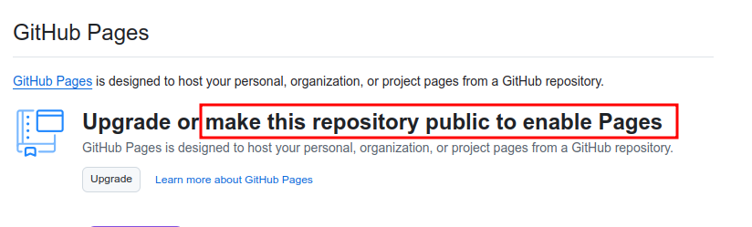
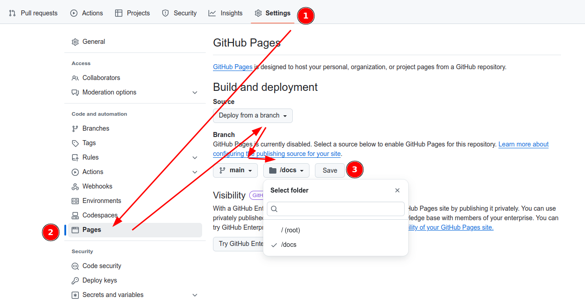
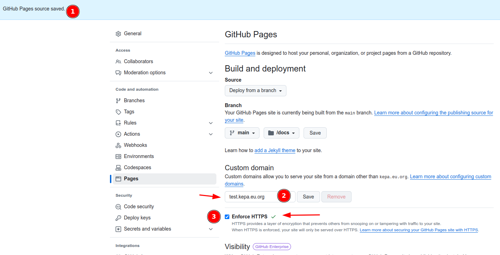
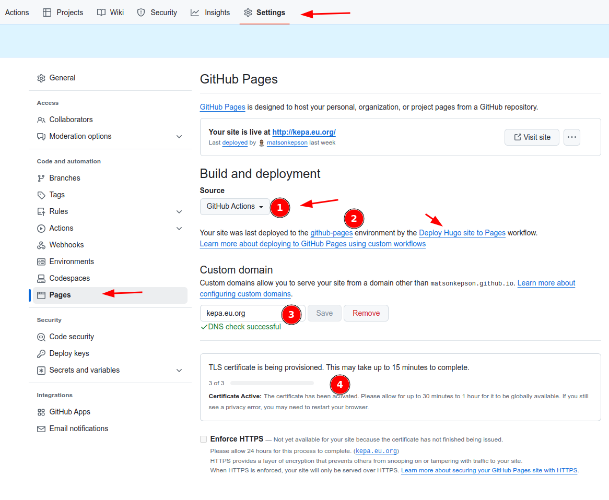

## preface

---

In this series of brief tutorials, I will show you how to generate a simple static website, host it on GitHub Pages with a custom domain, and do it all for free.

I've noticed many people using [Medium](https://medium.com/membership) to share their ideas, and it's a fantastic platform. The concentration of brilliant techies posting their thoughts and solutions is truly impressive. However, what about those who want to build their own brand, promote their own domain independently, and avoid getting lost in the crowd? While it's important to promote our site through various channels to achieve the best rankings, we can still host our small projects on our own domain where we have near-complete control.

## steps

### install hugo

---

To start creating your page, we first need to install the Hugo environment. There are various static page generators like [Jekyll](https://jekyllrb.com/), [Next.js](https://developer.mozilla.org/en-US/blog/static-site-generation-with-nextjs/), and [Gatsby](https://www.gatsbyjs.com/docs/glossary/static-site-generator/).

My goal was to be quite versatile. The benefits and ease of use when creating a website comes down to creating the proper Markdown files, which is both easy and awesome! I chose [Hugo](https://gohugo.io/) after digging into multiple sources and receiving good feedback, as well as the extensive marketplace of [themes](https://themes.gohugo.io/).

Hugo is blazing fast and is supported on many platforms and through multiple package managers. I personally use Ubuntu Linux as my base host, which is supported out of the box.

Whole setup details, including repositories, can be found under this [link](https://gohugo.io/installation/).

Keep in mind that Hugo requires [Golang](https://go.dev/doc/install) version 1.22 or higher and sometimes the [dart-sass](https://gohugo.io/hugo-pipes/transpile-sass-to-css/#dart-sass) package for proper CSS transpilation.

### create a simple website

---

The documentation steps can be found under this [link.](https://gohugo.io/getting-started/quick-start/)

After installing Hugo, you can check if it's ready to go by following these steps:

- Create a website with YAML as the starting config format (TOML is the default).
- Navigate to the folder of your website and init repo.
- Add the initial theme through a git submodule.
- Add the theme name to the base config.
- Run and check the output.

```bash
hugo new site demo --format yaml
cd demo && git init
git submodule add https://github.com/theNewDynamic/gohugo-theme-ananke.git themes/ananke
echo "theme: ananke" >> hugo.yaml
hugo serve
```

Navigate to the link from the CLI output to check the results, which by default is [http://localhost:1313/](http://localhost:1313) If the port is already taken, you will get a random port from the high port range (30000+).

Your whole statically generated page is in the **./public** folder within the demo directory. From here, you can take it and publish it wherever you like.

Keep in mind that if you did not stop the **hugo serve** command, all changes will be reflected immediately after saving any config or site files.

### install theme

---

:warning: This part can be tricky since each template works differently! Some templates work directly via a **git submodule add** or the **hugo mod get** command. Others need to be copied or cloned directly from the template creator's Git repository.

First, choose your favorite theme from the official site [https://themes.gohugo.io/](https://themes.gohugo.io/). Then, navigate to the details of the theme and follow the instructions provided in the description!

After you have found it and properly installed and configured the details, give it a try and run the **hugo serve** command!

### own domain

---

If you already have your domain, you can skip this point.

I have the privilege of having my domain registered with [nic.eu.org](https://nic.eu.org/), which is completely free of charge and leased for 100 years.

To register your own domain, please follow the instructions from this [link](https://nic.eu.org/opendomains.html).

Keep in mind that since this is an unpaid service, [any kind of help is welcome](https://nic.eu.org/tohelp.html), and the request can take some time. I waited around two years for mine, but that was more than ten years ago. It’s still worth it!

#### domain parking

To complement the open-source project of domain registration, I use the freeDNS 42 service [https://freedns.42.pl/](https://freedns.42.pl/index.php?language=en) where I parked my domain. It works brilliantly, and I can highly recommend it!

### point your origin to GitHubPages

---

The entire process is detailed in this [official GitHub Pages documentation](https://docs.github.com/en/pages/configuring-a-custom-domain-for-your-github-pages-site/managing-a-custom-domain-for-your-github-pages-site).

I am describing it prior to repository deployment because DNS changes can take up to 24 hours to propagate!

If you have your own domain registered already, inside your DNS settings point the A/AAAA or an ALIAS record of the origin **@** to the following IP addresses:

```bash
# IPv4 (A)
185.199.108.153
185.199.109.153
185.199.110.153
185.199.111.153

# IPv6 (AAAA)
2606:50c0:8000::153
2606:50c0:8001::153
2606:50c0:8002::153
2606:50c0:8003::153
```

An example dig anwser

```bash
# get A records
$ dig +nocmd +noall +answer www.kepa.eu.org A
www.kepa.eu.org.	6883	IN	CNAME	kepa.eu.org.
kepa.eu.org.		6883	IN	A	185.199.110.153
kepa.eu.org.		6883	IN	A	185.199.111.153
kepa.eu.org.		6883	IN	A	185.199.108.153
kepa.eu.org.		6883	IN	A	185.199.109.153

# get AAAA records
$ dig +nocmd +noall +answer kepa.eu.org AAAA
kepa.eu.org.		6917	IN	AAAA	2606:50c0:8001::153
kepa.eu.org.		6917	IN	AAAA	2606:50c0:8003::153
kepa.eu.org.		6917	IN	AAAA	2606:50c0:8000::153
kepa.eu.org.		6917	IN	AAAA	2606:50c0:8002::153

```

At a later step, when registering the custom domain in your GitHub repository, you will be asked to add a TXT record to verify that you are the owner of the DNS origin. This is a common process for many providers, so there's no need to worry.

#### redirection with www+yourTLD

Please don't forget to create a CNAME record inside your DNS Zone for your custom domain with **www** in front!

This will allow you to reach your website not only with the domain (TLD) but also with **www**.

For example, you can reach my website at [kepa.eu.org](http://kepa.eu.org) as well as [www.kepa.eu.org](http://www.kepa.eu.org). Many forget about this, but it's quite handy and eliminates potential issues with link forwarding!

Example anwser from dig

```bash
# get CNAME records for your www+tld domain
$ dig +nocmd +noall +answer www.kepa.eu.org CNAME
www.kepa.eu.org.	7119	IN	CNAME	kepa.eu.org.

```

### add proper .gitignore

When we run the **hugo** command, the engine generates several additional files and folders where we can see the result of our generated website. These files change quite frequently, so we might consider excluding them from the target repository, unless we intend to serve the build via GitHub Actions.

Keep in mind that after you run Hugo in your CLI shell, the **./public** folder is all you need to run your website. This folder contains everything necessary, such as HTML files, SCSS, JS, and images, and you're ready to go.

Below an example

```bash
# Hugo stuff
.hugo_build.lock
resources/
public/
```

### deploy to repo and activate pages

Before or after creating your repository, ensure that it is publicly available to host it properly.



We will now push our changes to the freshly created repository and activate GitHub Pages for it.

After the changes are pushed, navigate to

- the **Settings** :wheel: icon of this repository
- from the left sidebar, under **General** :wheel:
- go to **Pages** inside the _Code and automation_ section.

As mentioned before, since you have already generated your page, all you need to do is publish the content of the **./public** folder to your repository. You can add it either to the root directory **/(root)** or the **/docs** folder to publish your website. That's all you need to do for a classical setup.



However, if you want to build everything with GitHub Actions, please add the **.gitignore** file as mentioned earlier and publish the entire content of your current Hugo website folder.

### Custom Domain

#### CNAME and certificate

After saving your changes when deploying from a branch (GitHub Actions will follow), please add your custom domain name as described in step **2** (as shown in the picture). For more details, [follow this link](https://docs.github.com/en/pages/configuring-a-custom-domain-for-your-github-pages-site/managing-a-custom-domain-for-your-github-pages-site).

Additionally, make sure to enforce the HTTPS checkbox, as indicated in step **3**.

The domain of your choice should also be saved as a file named **CNAME**, containing the correct subdomain name, inside the folder of your website. Otherwise, proper HTTPS and domain redirection will not work. For more details, [follow this link](https://stackoverflow.com/questions/9082499/custom-domain-for-github-project-pages)



#### setup proper DNS TXT verification

After you create and activate your custom domain, you will be prompted to add an additional TXT challenge to your DNS configuration to verify ownership. For more details, [follow this link](https://docs.github.com/en/pages/configuring-a-custom-domain-for-your-github-pages-site/verifying-your-custom-domain-for-github-pages).

### deploy with GH Actions

#### proper file
[Original docu link](https://gohugo.io/hosting-and-deployment/hosting-on-github/)
[Link to my repo](https://github.com/matsonkepson/matsonkepson.github.io/blob/main/.github/workflows/hugo-deploy.yaml)

```yaml
# Sample workflow for building and deploying a Hugo site to GitHub Pages
name: Deploy Hugo site to Pages

on:
  # Runs on pushes targeting the default branch
  push:
    branches:
      - main

  # Allows you to run this workflow manually from the Actions tab
  workflow_dispatch:

# Sets permissions of the GITHUB_TOKEN to allow deployment to GitHub Pages
permissions:
  contents: read
  pages: write
  id-token: write

# Allow only one concurrent deployment, skipping runs queued between the run in-progress and latest queued.
# However, do NOT cancel in-progress runs as we want to allow these production deployments to complete.
concurrency:
  group: "pages"
  cancel-in-progress: false

# Default to bash
defaults:
  run:
    shell: bash

jobs:
  # Build job
  build:
    runs-on: ubuntu-22.04
    env:
      HUGO_VERSION: 0.137.1
    steps:
      - name: Install Hugo CLI
        run: |
          wget -O ${{ runner.temp }}/hugo.deb https://github.com/gohugoio/hugo/releases/download/v${HUGO_VERSION}/hugo_extended_${HUGO_VERSION}_linux-amd64.deb \
          && sudo dpkg -i ${{ runner.temp }}/hugo.deb          
      - name: Install Dart Sass
        run: sudo snap install dart-sass
      - name: Checkout
        uses: actions/checkout@v4
        with:
          submodules: recursive
          fetch-depth: 0
      - name: Setup Pages
        id: pages
        uses: actions/configure-pages@v5
      - name: Install Node.js dependencies
        run: "[[ -f package-lock.json || -f npm-shrinkwrap.json ]] && npm ci || true"
      - name: Build with Hugo
        env:
          HUGO_CACHEDIR: ${{ runner.temp }}/hugo_cache
          HUGO_ENVIRONMENT: production
          TZ: Etc/UTC
        run: |
          hugo \
            --environment prod         
      - name: Upload artifact
        uses: actions/upload-pages-artifact@v3
        with:
          path: ./public

  # Deployment job
  deploy:
    environment:
      name: github-pages
      url: ${{ steps.deployment.outputs.page_url }}
    runs-on: ubuntu-22.04
    needs: build
    steps:
      - name: Deploy to GitHub Pages
        id: deployment
        uses: actions/deploy-pages@v4
```

#### proper setting inside repository settings



### next steps

---


[In my next post](https://kepa.eu.org/blog/post001-how-to-setup-custom-and-secure-custom-mail-domain-with-zoho/), I'll show you how to properly set up a free and secure email box with custom domain which works like a charm.

- create custom mail with zoho
- setup spf + dkim