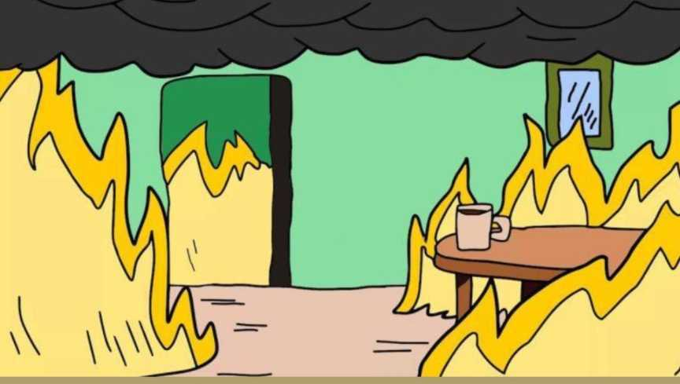
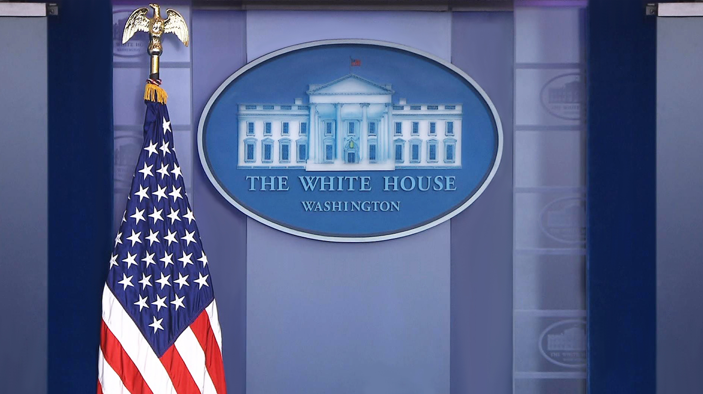
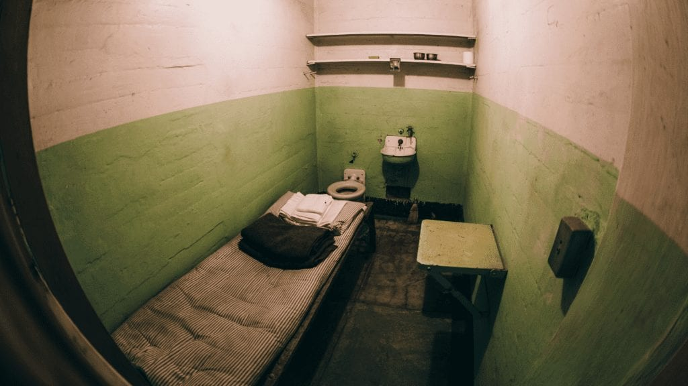
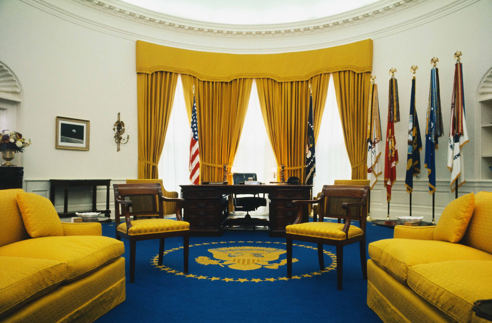
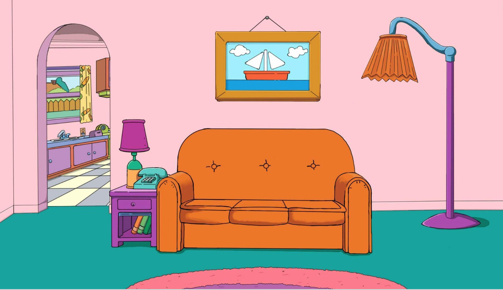
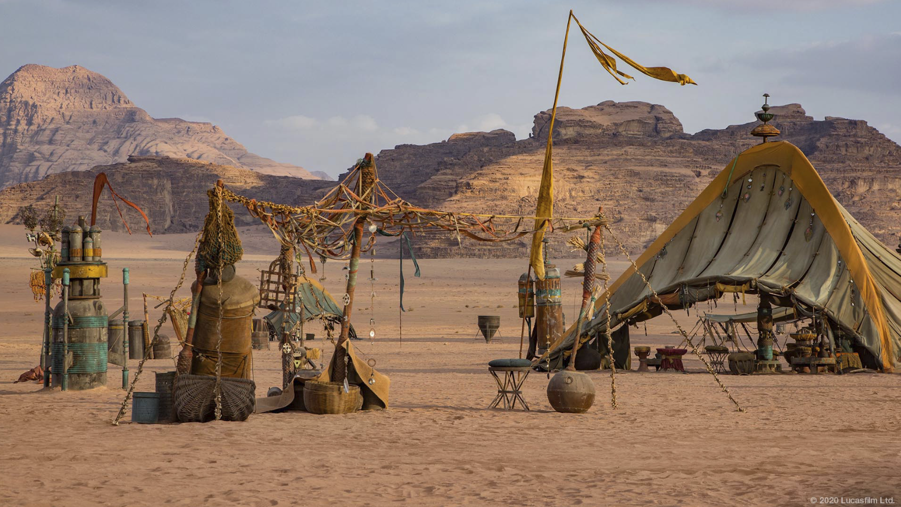
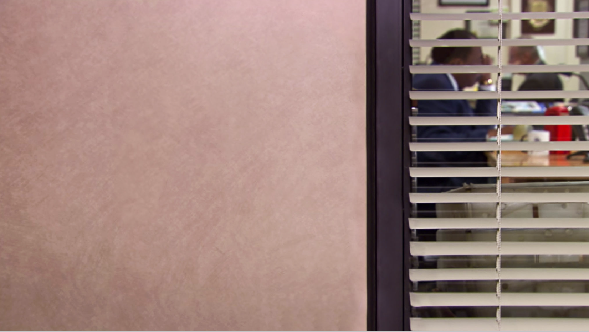
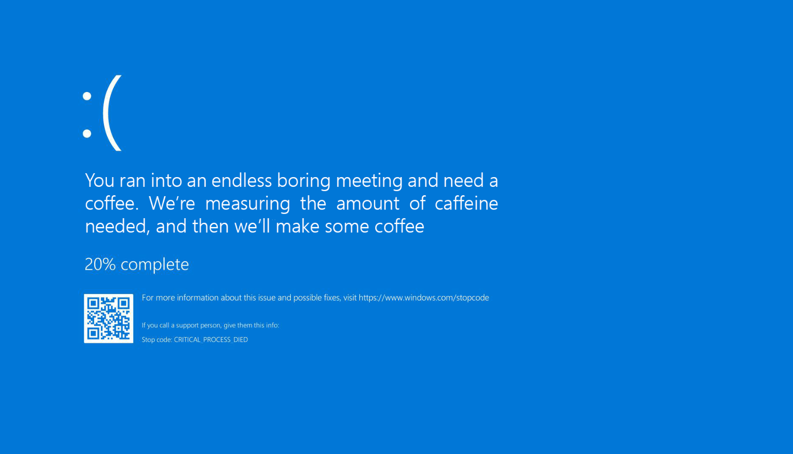
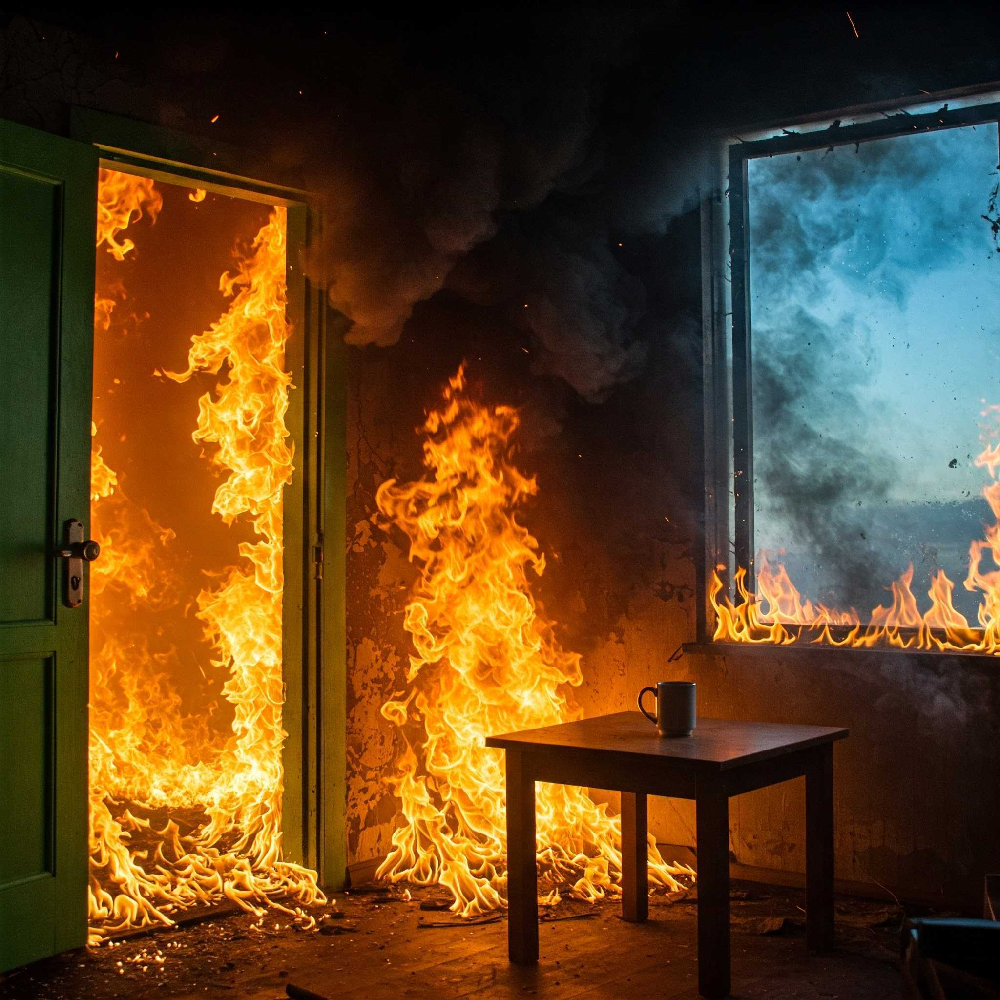

## Something Funny Today

---

Recently, I found myself in some truly dreary work meetings. The topics were heavy, the mood was grim, and I thought, **why not spice things up a little?** The idea of customizing my Teams background to lighten the atmosphere.

It seemed like a brilliant plan(at least to me). However not everyone appreciated it, of course (some people take life way too seriously)... But hey, it brought a smile to a few faces, and that’s what bounds people together, right?

If you’re stuck in a similar situation, why not give it a try? A little humor can go a long way in turning a dull meeting into something sparkling :tada:

### My Collection of Funny Teams Backgrounds

Here are some of my favorite Teams backgrounds :smiley:

Feel free to download and use them to add some fun to your meetings!

| Backgrounds                                                 |
| ----------------------------------------------------------- |
|       |
|  |
|               |
|  |
|         |
|       |
|       |
|      |
|    |
|   |

| Bonus - Gemini AI altered first background                   |
| ------------------------------------------------------------ |
|  |

P.S.
Special thanks to [LazyAdmin](https://lazyadmin.nl/) for the inspiration.

---
