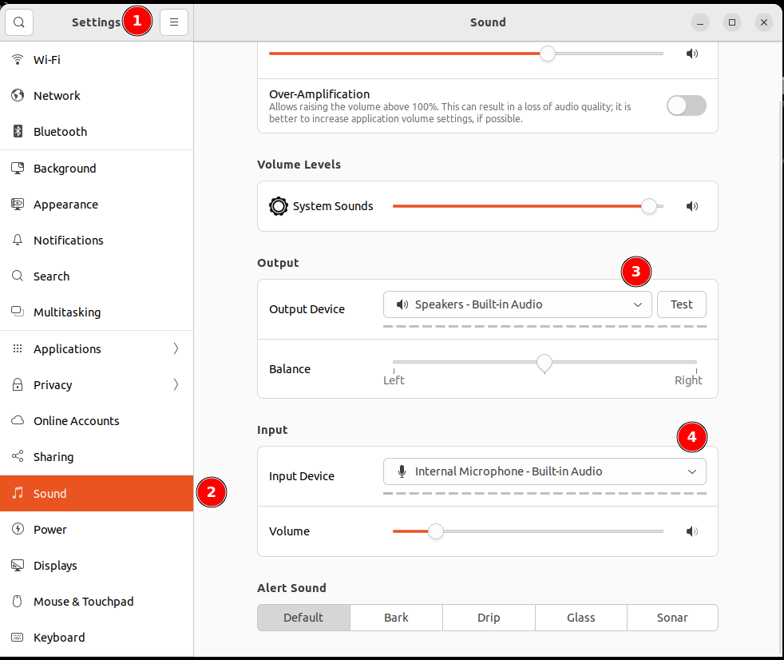

## preface

---

Recently, I have been working constantly with my old laptop that runs Ubuntu. Each time I log in, I have to manually change the input and output device settings for sound, which is quite annoying. To resolve this, I created a script that sets these preferences at startup, so I don't need to adjust them manually each time.

## steps

---

### prior to script run!

In Ubuntu Desktop: :computer:

Run Settings :wheel:

Go to Sound→Output→Output Device :sound: | →Input Device :microphone:

Select appropriate device from drop down list like below!



### the easy way

```bash
# Get active Speakers
export DEFAULT_SINK=`pactl get-default-sink`
# Get active Microphone
export DEFAULT_MIC=`pactl get-default-source`

# Set default audio output device
pactl set-default-sink ${DEFAULT_SINK}
# Set default audio input device
pactl set-default-source ${DEFAULT_MIC}

```

### the preffered way

I have created this [>Gist<](https://gist.github.com/matsonkepson/de6327b8aa7677c6048ff1d29c81be57) which you only need to run once to resolve the issue.
Below is an Gist script that you can use to set this up for autostart:

```bash
#!/usr/bin/env bash

#get all devices
echo "> List all devices"
echo "> Listing Microphones"
pactl list short sources
echo "> Listing Speakers"
pactl list short sinks
echo

#get default ACTIVE devices
export DEFAULT_SINK=$(pactl get-default-sink)  # get active speakers
export DEFAULT_MIC=$(pactl get-default-source) # get active mic

echo "Your default Mic: ${DEFAULT_MIC}"
echo "Your default Speaker: ${DEFAULT_SINK}"
echo

do_changes() {
    echo "> setup mic"
    cat <<_EOF >~/.config/autostart/default-mic.desktop
[Desktop Entry]
Type=Application
Exec=pactl set-default-sink ${DEFAULT_MIC}
Hidden=false
NoDisplay=false
X-GNOME-Autostart-enabled=true
Name[en_US]=Default Mic
Name=Default Mic
Comment[en_US]=Setting default Microphone for every new session
Comment=Setting default Microphone for every new session
_EOF

    echo "> setup speaker"
    cat <<_EOF >~/.config/autostart/default-speaker.desktop
[Desktop Entry]
Type=Application
Exec=pactl set-default-sink ${DEFAULT_SINK}
Hidden=false
NoDisplay=false
X-GNOME-Autostart-enabled=true
Name[en_US]=Default Speaker
Name=Set default Speaker
Comment[en_US]=Setting default speaker for every new session
Comment=Setting default speaker for every new session
_EOF

}

read -p "Are you SURE you set your defaults properly ? [y/n]: " answer
if [[ $answer =~ ^[Yy]$ ]]; then
    echo "Proceeding..."
    do_changes
else
    echo "Exiting..."
    exit 1
fi


```

The output should look like the example in the picture below. :tada:


